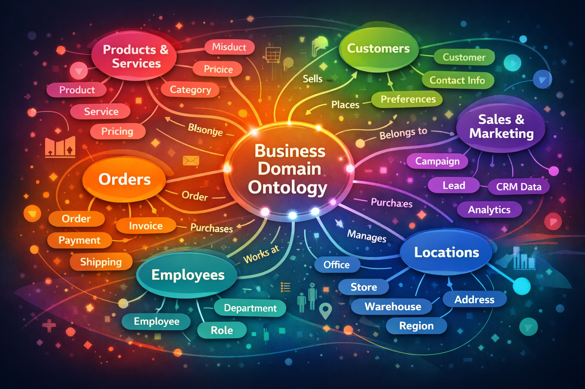

# Building an Ontology in Microsoft Fabric: A Trucking Domain Walkthrough

> **Companion tutorial for the `trucking-ontology` GitHub repository.**
>
> **Want to jump straight into setup?** → [Go to Prerequisites & Environment Setup](#4-prerequisites--environment-setup)
---

## Table of Contents

1. [What Is an Ontology?](#1-what-is-an-ontology)
2. [Ontologies in Microsoft Fabric](#2-ontologies-in-microsoft-fabric)
3. [What We're Building](#3-what-were-building)
4. [Prerequisites & Environment Setup](#4-prerequisites--environment-setup)
5. [Create the Ontology](#5-create-the-ontology)
6. [Explore What Was Created](#6-explore-what-was-created)
7. [Add Timeseries Event Data to Entities](#7-add-timeseries-event-data-to-entities)
8. [Create a Data Agent](#8-create-a-data-agent)
9. [See the Data Agent Work with the Ontology](#9-see-the-data-agent-work-with-the-ontology)
10. [Next Steps](#10-next-steps)

---

## 1. What Is an Ontology?

<p align="center">
  
</p>

The word *ontology* comes from philosophy, where it means "the study of what exists." In data and analytics, it means something far more practical:

> **An ontology is a structured representation of the things in your business domain, the properties those things have, and the relationships between them.**

Think of it as a map of meaning — not the raw data itself, but the *understanding* behind the data.

A well-designed ontology in a data analysis context connects three layers:

| Layer | Description | Example |
|-------|-------------|---------|
| **Data** | The information used to make decisions | Tables, events, telemetry streams |
| **Logic** | The reasoning applied to evaluate decisions | Business rules, thresholds, constraints |
| **Action** | The execution of a decision | Alerts, workflows, agent steps |

Most analytics platforms stop at **Data**. Some reach into **Logic** with calculated measures or KPIs. An ontology connects all three — it's not just a semantic layer, it's a **decision layer**.

### Design Principles

Before building, ask three questions:

1. **What are the things in my domain?** → These become your *entity types*
2. **What properties do those things have?** → These become *attributes*
3. **How do those things relate to each other?** → These become *relationships*

**Naming relationships well is critical.** Use active verbs that read like a natural sentence:

| ✅ Good | ❌ Avoid |
|---------|---------|
| `Truck performs Trip` | `Truck assigned-to Trip` |
| `Driver operates Truck` | `Truck Driven By Driver` |
| `Trip originates-from Terminal` | `Trip linked Terminal` |

The entity that performs many instances of an action points toward the entity it acts on. This makes graph traversal intuitive and your model readable by humans and AI alike.

---

## 2. Ontologies in Microsoft Fabric

The **Ontology item** in Microsoft Fabric is part of the **IQ (Intelligence Quotient) workload**. It makes ontology modeling accessible inside the same platform you already use for analytics.

### Key Capabilities

- **Entity types** — Define the concepts in your domain (Truck, Driver, Trip, Load, Terminal)
- **Properties** — Attach typed attributes to each entity type
- **Relationships** — Connect entity types with named, directed edges
- **Data bindings** — Bind entity types directly to Lakehouse Delta tables, Eventhouse KQL tables, or Semantic Model measures
- **Graph queries (GQL)** — Traverse relationships natively; queries push down to underlying engines
- **Natural Language queries (NL2Ontology)** — Ask business questions in plain English; the ontology translates them into structured graph queries
- **Real-time events** — Bind streaming KQL tables to entity types so your ontology reflects live operational data

Because it lives in Fabric, the ontology is governed, discoverable across your tenant, and queryable at scale without moving data.

---

## 3. What We're Building

This demo models a **long-haul trucking company** with a fleet of trucks, drivers, loads, and routes across regional terminals.

### Domain Entities

| Entity | Source | Description |
|--------|--------|-------------|
| `Truck` | Lakehouse → `trucks` | Fleet vehicles with VIN, status, odometer |
| `Driver` | Lakehouse → `drivers` | Drivers with CDL endorsements, HOS state |
| `Trip` | Lakehouse → `trips` | Scheduled movements between terminals |
| `Route` | Lakehouse → `routes` | Origin/destination pairs with distance/hours |
| `Terminal` | Lakehouse → `terminals` | Distribution centers and depots |
| `Load` | Lakehouse → `loads` | Freight assignments per trip |
| `Customer` | Lakehouse → `customers` | Shippers who own the loads |
| `Trailer` | Lakehouse → `trailers` | Trailers assigned to trips |

### Event Data

| Event Table | Source | Description |
|-------------|--------|-------------|
| `TelemetryEvent` | Eventhouse KQL | Real-time GPS, speed, fuel every 30 s per truck |
| `EngineFaultEvent` | Eventhouse KQL | J1939 diagnostic trouble codes |
| `GeofenceEvent` | Eventhouse KQL | Terminal arrival / departure |
| `HOSStatusChangeEvent` | Eventhouse KQL | Driver duty status transitions |
| `LoadStatusEvent` | Eventhouse KQL | Load lifecycle (in-transit, delivered, delayed) |

### Demo Scenarios

The event generator injects five realistic scenarios you can query through the ontology:

- 🚨 **Late Arrival** — truck falling behind schedule
- 🚨 **Breakdown** — critical fault code mid-trip
- 🚨 **HOS Violation Risk** — driver approaching hours-of-service limits
- 🚨 **Maintenance Due** — odometer crossing threshold
- 🚨 **Load Reassignment** — load reassigned after breakdown

---

## 4. Prerequisites & Environment Setup

### Requirements

| Requirement | Detail |
|-------------|--------|
| Microsoft Fabric workspace | F16 capacity minimum |
| Workspace role | Contributor or higher (Admin recommended) |
| Tenant settings enabled | Graph (preview), Ontology item (preview), Data agent (preview), Copilot / Azure OpenAI |

> There's a full list of pre-requesites stated in 00_demo_setup.ipynb before running. 
### Upload Notebooks to Fabric

Before running anything, upload all four notebooks from the [`notebooks/`](notebooks/) folder in this repository to your Fabric workspace:

| Notebook | Purpose |
|----------|---------|
| `notebooks/00_demo_setup.ipynb` | Main setup orchestrator — run this one |
| `notebooks/01_load_reference_data.ipynb` | Creates delta tables in lakehouse |
| `notebooks/02_generate_events.ipynb` | Hydrates Eventhouse tables with event data |
| `notebooks/03_create_ontology.ipynb` | Builds the trucking ontology via the Fabric REST API |

To upload:
1. In your Fabric workspace, click **+ New item** → **Import notebook**
2. Select all four `.ipynb` files from the `notebooks/` folder
3. Confirm they appear in your workspace before proceeding

> `00_demo_setup` will automatically call the other notebooks — you only need to open and run `00_demo_setup` yourself. Steps 3, 6, and 7 (if `create_ontology = True`) invoke the other notebooks via `notebookutils.notebook.run()`, so all four must be in the **same workspace** or those steps will fail.

### Run the Setup Notebook

All infrastructure is provisioned automatically by **`notebooks/00_demo_setup.ipynb`**. Upload it to your Fabric workspace and run each cell in order:

| Step | What It Does |
|------|-------------|
| **Step 1** | Creates the `lh_trucking` Lakehouse |
| **Step 2** | Generates synthetic reference data (11 JSONL files) and uploads to OneLake |
| **Step 3** | Runs `01_load_reference_data.ipynb` — creates Delta tables for all 8 reference entities |
| **Step 4** | Deploys the `TruckingSM` Power BI Semantic Model with a Direct Lake connection to `lh_trucking` |
| **Step 5** | Creates the `eh_trucking` Eventhouse and `trucking_db` KQL database, then creates the 5 event tables |
| **Step 6** | Runs `02_generate_events.ipynb` — generates 1–10 minutes of synthetic event streams and ingests them into Eventhouse |
| **Step 7** *(optional)* | Runs `03_create_ontology.ipynb` — creates the trucking ontology via the Fabric REST API. Only executes if `create_ontology = True` in the config cell. Set to `False` to create the ontology manually (see §5 Option 2). |

> **Tip:** Every step is idempotent — safe to re-run if something fails partway through.

After the setup notebook completes, your workspace will contain:
- `lh_trucking` — Lakehouse with 8 Delta tables
- `TruckingSM` — Semantic Model (Direct Lake)
- `eh_trucking` — Eventhouse with `trucking_db` and 5 KQL event tables

---

## 5. Create the Ontology

The ontology defines the entity types and relationships that the Data Agent uses to understand your data. There are two ways to create it:

### Option 1 — Run the Notebook (Automated)

`03_create_ontology.ipynb` builds the full ontology programmatically via the Fabric REST API. This is the fastest path and is driven automatically by `00_demo_setup.ipynb` when `create_ontology = True` (the default).

**What the notebook does:**
1. Reads each Lakehouse table schema from `lh_trucking`
2. Creates an **entity type** for each table using the key and display columns below
3. Registers **relationship types** between entities

When `create_ontology = True` in `00_demo_setup.ipynb`, Step 7 automatically runs this notebook. If you set `create_ontology = False`, skip to **Option 2** to create everything manually.

### Option 2 — Create Manually from the Semantic Model

If you prefer a UI-driven approach, you can generate the ontology interactively directly from the `TruckingSM` semantic model in Fabric. This requires `create_ontology = False` in `00_demo_setup.ipynb`.

### 5.1 Create the Ontology

1. In your Fabric workspace, locate **`TruckingSM`** (the Semantic Model deployed by Step 4 of the setup notebook)
2. Right-click on `TruckingSM` and select **Create ontology**
3. Give it a name — e.g. `TruckingOntology` — and confirm

Fabric will begin generating the ontology from the semantic model. This typically takes **2–5 minutes**. You’ll see a progress indicator while it processes the model’s tables, columns, measures, and relationships.

> Do not close the browser tab while provisioning is in progress.

### 5.2 What Gets Created Automatically

Once provisioning completes, Fabric will have created:

| Created | From |
|---------|------|
| Entity types | One per table in the semantic model (`Truck`, `Driver`, `Trip`, `Route`, `Terminal`, `Load`, `Customer`) |
| Properties | One per column, with types inferred from the model |
| Relationships | Inferred from the model’s existing joins and foreign key relationships |
| Data bindings | Each entity type bound to its source Lakehouse Delta table via Direct Lake |

### 5.3 Validate and Fix Relationships & Entity Keys

After the ontology is generated, open it in the editor and review each entity type. Fabric auto-generates relationship names from the column join definitions in the semantic model — these are often generic and should be renamed to follow the active-verb convention before publishing.

#### Entity Key Validation

Verify the **key property** is set correctly for each entity type:

| Entity Type | Key Property | Display Property |
|-------------|-------------|-----------------|
| `Customer` | `customer_id` | `name` |
| `Driver` | `driver_id` | `last_name` |
| `Load` | `load_id` | `load_number` |
| `Route` | `route_id` | `route_name` |
| `Terminal` | `terminal_id` | `name` |
| `Trailer` | `trailer_id` | `trailer_number` |
| `Trip` | `trip_id` | `trip_number` |
| `Truck` | `truck_id` | `truck_number` |

To check: click each entity type → open **Properties** → confirm the key icon (🔑) is on the correct column.

> ⚠️ **The ontology does not always pick the correct primary key automatically.** After generation, go through every entity type and verify the key is set to the correct column. If it is wrong, click the column that should be the key and set it manually. Using the wrong key will cause relationship joins and graph queries to return incorrect or empty results.

#### Relationship Reference Table

Use this table to validate and rename each auto-generated relationship. Select each relationship edge in the canvas, open its properties, and update the name to match the **Relationship Type Name** column below.

| Relationship Name | Source Data Table | Source Entity | Source Key | Target Entity | Target Key |
|-------------------|-----------------|--------------|-----------|--------------|-----------|
| `TripCarriesLoad` | `trips` | Trip | `trip_id` | Load | `load_id` |
| `TripHasDriver` | `trips` | Trip | `trip_id` | Driver | `driver_id` |
| `TripFollowsRoute` | `trips` | Trip | `trip_id` | Route | `route_id` |
| `TruckMakesTrip` | `trips` | Truck | `truck_id` | Trip | `trip_id` |
| `TripMovesTrailer` | `trips` | Trip | `trip_id` | Trailer | `trailer_id` |
| `RouteOriginTerminal` | `routes` | Route | `route_id` | Terminal | `origin_terminal_id` |
| `RouteDestinationTerminal` | `routes` | Route | `route_id` | Terminal | `destination_terminal_id` |
| `LoadForCustomer` | `loads` | Load | `load_id` | Customer | `customer_id` |


#### How to Rename a Relationship

1. Click the relationship edge on the canvas
2. In the **Properties** panel on the right, find the **Name** field
3. Update it to the active-verb name from the table above (e.g. `Truck performs Trip`)
4. Click **Save**

## 6. Explore What Was Created

Once the import is complete, take a moment to understand the graph that was built.

### 6.1 The Graph Canvas

The Ontology editor's **canvas view** shows your entities as nodes and relationships as directed edges. You should see:

- **8 entity nodes** connected by relationship edges
- Properties panel on the right when you click any node
- Relationship labels on each edge

### 6.2 Inspect an Entity Type

Click on **Truck**. In the properties panel you'll see:

| Property | Type | Source Column |
|----------|------|---------------|
| `truck_id` | String | `truck_id` |
| `truck_number` | String | `truck_number` |
| `make` | String | `make` |
| `model` | String | `model` |
| `year` | Int | `year` |
| `vin` | String | `vin` |
| `status` | String | `status` |
| `odometer_miles` | Int | `odometer_miles` |
| `next_maintenance_miles` | Int | `next_maintenance_miles` |

### 6.3 Try a Graph Query

In the "View entity type overview", click on **Expand** in the relationship graph. On **Query builder**, you can try connecting the nodes or you can open **Code editor** and paste the code below to try a GQL query to traverse the graph:

```gql
MATCH (node_Truck:`Truck`)-[edge1_TruckMakesTrip:`TruckMakesTrip`]->(node_Trip:`Trip`),
      (node_Trip:`Trip`)-[edge2_TripCarriesLoad:`TripCarriesLoad`]->(node_Load:`Load`)
WHERE node_Truck.status = 'available'
RETURN node_Truck.truck_number, node_Trip.trip_number, node_Load.load_number
LIMIT 1000
```

This retrieves all available trucks, the trips they're currently performing, and the loads they're carrying — in one graph traversal, no SQL joins required.

---

## 7. Add Timeseries Event Data to Entities

Rather than creating separate event entity types, you can enrich existing reference entities with **Timeseries** bindings — attaching live Eventhouse data directly to the entities that own it. This section adds four bindings: GPS/telemetry to `Trip`, engine faults to `Truck`, load status to `Load`, and HOS events to `Driver`.

### 7.1 Bind TelemetryEvent to Trip

1. In the ontology editor, click on the **`Trip`** entity type to open the **Entity type configuration** pane
2. Go to the **Bindings** tab → click **Add data to entity type**
3. Select your workspace → **`eh_trucking`** Eventhouse → **`trucking_db`** database → **`TelemetryEvent`** table → click **Next**
4. For **Binding type**, select **Timeseries**
5. For **Source data timestamp column**, select `timestamp`
6. Under **Bind your properties**, map the columns:

   | Column | Property Type |
   |--------|---------------|
   | `trip_id` | Static |
   | `timestamp` | *(timestamp column — already set above)* |
   | `truck_id` | Timeseries |
   | `latitude` | Timeseries |
   | `longitude` | Timeseries |
   | `speed_mph` | Timeseries |
   | `heading_degrees` | Timeseries |
   | `fuel_pct` | Timeseries |
   | `engine_temp_f` | Timeseries |
   | `oil_pressure_psi` | Timeseries |
   | `odometer_miles` | Timeseries |
   | `engine_rpm` | Timeseries |
   | `ambient_temp_f` | Timeseries |
   | `def_level_pct` | Timeseries |

7. Click **Save**

The `Trip` entity now has two data bindings: the original static binding from `lh_trucking.trips` and the new timeseries binding from `trucking_db.TelemetryEvent`.

> **Note:** The `trip_id` column in `TelemetryEvent` is the link between the timeseries data and the Trip entity instances. Make sure it matches the key property on `Trip`.

### 7.2 Bind EngineFaultEvent to Truck

The `EngineFaultEvent` table records J1939 diagnostic trouble codes keyed by `truck_id`. Bind it to the existing `Truck` entity type to surface fault history directly on each truck.

1. In the ontology editor, click on the **`Truck`** entity type to open the **Entity type configuration** pane
2. Go to the **Bindings** tab → click **Add data to entity type**
3. Select your workspace → **`eh_trucking`** Eventhouse → **`trucking_db`** database → **`EngineFaultEvent`** table → click **Next**
4. For **Binding type**, select **Timeseries**
5. For **Source data timestamp column**, select `timestamp`
6. Under **Bind your properties**, map the columns:

   | Column | Property Type |
   |--------|---------------|
   | `truck_id` | Static |
   | `timestamp` | *(timestamp column — already set above)* |
   | `trip_id` | Timeseries |
   | `driver_id` | Timeseries |
   | `spn` | Timeseries |
   | `fmi` | Timeseries |
   | `fault_description` | Timeseries |
   | `severity` | Timeseries |
   | `occurrence_count` | Timeseries |
   | `latitude` | Timeseries |
   | `longitude` | Timeseries |
   | `action` | Timeseries |

7. Click **Save**

The `Truck` entity now has two data bindings: the original static binding from `lh_trucking.trucks` and the new timeseries binding from `trucking_db.EngineFaultEvent`.

> **Note:** The `truck_id` column in `EngineFaultEvent` links to Truck entity instances and must match the key property on `Truck`.

### 7.3 Bind LoadStatusEvent to Load

The `LoadStatusEvent` table records load lifecycle status changes keyed by `load_id`. Bind it to the existing `Load` entity type.

1. In the ontology editor, click on the **`Load`** entity type to open the **Entity type configuration** pane
2. Go to the **Bindings** tab → click **Add data to entity type**
3. Select your workspace → **`eh_trucking`** Eventhouse → **`trucking_db`** database → **`LoadStatusEvent`** table → click **Next**
4. For **Binding type**, select **Timeseries**
5. For **Source data timestamp column**, select `timestamp`
6. Under **Bind your properties**, map the columns:

   | Column | Property Type |
   |--------|---------------|
   | `load_id` | Static |
   | `timestamp` | *(timestamp column — already set above)* |
   | `trip_id` | Timeseries |
   | `customer_id` | Timeseries |
   | `load_number` | Timeseries |
   | `previous_status` | Timeseries |
   | `new_status` | Timeseries |
   | `terminal_id` | Timeseries |
   | `latitude` | Timeseries |
   | `longitude` | Timeseries |
   | `estimated_arrival` | Timeseries |
   | `notes` | Timeseries |

7. Click **Save**

The `Load` entity now has two data bindings: the original static binding from `lh_trucking.loads` and the new timeseries binding from `trucking_db.LoadStatusEvent`.

> **Note:** The `load_id` column in `LoadStatusEvent` links to Load entity instances and must match the key property on `Load`.

### 7.4 Bind HOSStatusChangeEvent to Driver

The `HOSStatusChangeEvent` table records driver duty status transitions keyed by `driver_id`. Bind it to the existing `Driver` entity type.

1. In the ontology editor, click on the **`Driver`** entity type to open the **Entity type configuration** pane
2. Go to the **Bindings** tab → click **Add data to entity type**
3. Select your workspace → **`eh_trucking`** Eventhouse → **`trucking_db`** database → **`HOSStatusChangeEvent`** table → click **Next**
4. For **Binding type**, select **Timeseries**
5. For **Source data timestamp column**, select `timestamp`
6. Under **Bind your properties**, map the columns:

   | Column | Property Type |
   |--------|---------------|
   | `driver_id` | Static |
   | `timestamp` | *(timestamp column — already set above)* |
   | `trip_id` | Timeseries |
   | `truck_id` | Timeseries |
   | `previous_status` | Timeseries |
   | `new_status` | Timeseries |
   | `driving_hours_used` | Timeseries |
   | `driving_hours_remaining` | Timeseries |
   | `duty_hours_used` | Timeseries |
   | `duty_hours_remaining` | Timeseries |
   | `cycle_hours_used` | Timeseries |
   | `cycle_hours_remaining` | Timeseries |
   | `break_time_remaining_minutes` | Timeseries |
   | `latitude` | Timeseries |
   | `longitude` | Timeseries |

7. Click **Save**

The `Driver` entity now has two data bindings: the original static binding from `lh_trucking.drivers` and the new timeseries binding from `trucking_db.HOSStatusChangeEvent`.

> **Note:** The `driver_id` column in `HOSStatusChangeEvent` links to Driver entity instances and must match the key property on `Driver`.
---

## 8. Create a Data Agent

A **Data Agent** in Fabric is an AI-powered conversational interface backed by your data. When you connect it to your ontology, it can answer natural language business questions by generating and executing graph queries.

### 8.1 Create the Data Agent Item

1. In your workspace, click **+ New item**
2. Search for **Data agent** (preview)
3. Name it `TruckingAgent` and click **Create**

### 8.2 Connect the Ontology

1. In the Data agent editor, click **+ Add data source**
2. Select **Ontology**
3. Choose `TruckingOntology`

The agent now has access to all entity types, properties, and relationships you've defined.

### 8.3 Add Instructions (System Prompt)

In the **Instructions** panel, add context to help the agent reason about the trucking domain:

```
You are a trucking operations assistant. You have access to a trucking ontology 
that includes fleet data (trucks, drivers, trips, routes, terminals, loads, customers) 
and real-time event streams (telemetry, engine faults, HOS status, load status).

When answering questions:
- Use the ontology graph to traverse relationships rather than assuming flat table lookups
- For real-time questions (location, speed, HOS hours), use the event entity types
- For operational questions (which truck, which driver, which load), use the reference entities
- Always cite the data behind your answer
- Do not return ids unless user ask for it
```

### 8.4 Try out some starting questions

Some questions to help you validate the agent:

- *Are any drivers close to their HOS limit right now?*
- *Which trips are at risk of late arrival?*
- *What have been the average RPM for trips originating from Atlanta?*

---

## 9. See the Data Agent Work with the Ontology


### 9.1 Natural Language to Graph Query

Ask the agent in plain English:

> *"Which trucks have had a critical engine fault in the last hour?"*

Behind the scenes, the NL2Ontology layer:
1. Identifies `Truck` and `EngineFaultEvent` as the relevant entity types
2. Recognizes the `Truck raises EngineFaultEvent` relationship
3. Generates a GQL query filtered on `severity = 'critical'` and `timestamp > now() - 1h`
4. Executes the query against Eventhouse via KQL pushdown
5. Returns results in a human-readable format

### 9.2 Demo Scenario Queries

Use the agent to investigate the injected scenarios:

| Question | What the Ontology Uses |
|----------|----------------------|
| *"Which loads are at risk of late delivery?"* | `Load → LoadStatusEvent` where notes contain "Late arrival" |
| *"Is any truck broken down right now?"* | `Truck → EngineFaultEvent` with `severity = 'critical'` + `Truck` speed = 0 |
| *"Which drivers need a break soon?"* | `Driver → HOSStatusChangeEvent` where `driving_hours_remaining < 1.0` |
| *"What truck needs maintenance most urgently?"* | `Truck` where `odometer_miles >= next_maintenance_miles` |
| *"What is the count of trucks by make and model?"* | `Truck` applying a SUM and Group by to the query" |
| *"Give me a list of drivers."* | `Drivers` return a simple list from a single Entity" |
| *"Which loads have been reassigned today?"* | `Load → LoadStatusEvent` where notes contain "reassignment" |


### 9.3 Graph Traversal Example

Ask a multi-hop question that requires traversing several relationships:

> 1. *"For the driver closest to their HOS limit, what load are they carrying and which customer does it belong to?"*

This requires traversing: `Driver → HOSStatusChangeEvent` (to find the at-risk driver) → `Trip` (via `Driver operates Truck → Trip`) → `Load` → `Customer` — four hops in a single graph query that would require four SQL joins without the ontology.

---

## 10. Next Steps

Once you've completed the walkthrough, here are directions to explore further:

### Extend the Ontology

| Idea | How |
|------|-----|
| Add a `MaintenanceRecord` entity | Create a new Delta table, bind to a new entity type, relate to `Truck` |
| Add `Weather` conditions | Bind a weather API or KQL table; relate to `Route` or `Trip` |
| Add `Geofence` zones | Bind `GeofenceEvent` to `Terminal` via the `terminal_id` key |
| Create derived relationships | Use KQL computed columns to infer relationships (e.g., `Truck near Terminal`) |

### Add Ontology Actions

Fabric's ontology supports **actions** — logic that fires when conditions are met:

- Alert dispatch when a truck raises a critical fault
- Trigger a load reassignment workflow when a trip is marked at risk
- Notify the customer when their load status changes to `delayed`

### Enable Natural Language Queries for Business Users

Share the `TruckingAgent` with non-technical stakeholders. They can ask questions in plain English without knowing GQL, KQL, or the underlying schema. The ontology acts as the translation layer between business language and data.

### Build a Dashboard on Top of the Ontology

Use Power BI connected to the semantic model + KQL querysets to build operational dashboards. The ontology ensures the measures and relationships in the dashboards match the governed definitions in your ontology — one source of truth.

---

## Reference

### 📺 Video Walkthroughs

These companion videos extend the demo with additional scenarios:

| Video | Description |
|-------|-------------|
| [Designing and Building an Ontology in Microsoft Fabric (uncut)](https://www.youtube.com/watch?v=HrWErMwKjbI) | Full uncut walkthrough of designing and building the trucking ontology end-to-end in Microsoft Fabric |
| [Extending the Ontology with Realtime Telematics](https://youtu.be/6V9mDSNoXz4) | Walks through binding live Eventhouse telemetry to the trucking ontology and querying it in real time |
| [Integrating the Data Agent with a Multi-source Foundry Agent](https://youtu.be/ognvJ6oKW-M) | Shows how to connect the TruckingAgent to a Foundry-based multi-agent orchestration pipeline |

---

*Microsoft Fabric Ontology is currently in preview. Features and capability may change before general availability.*
